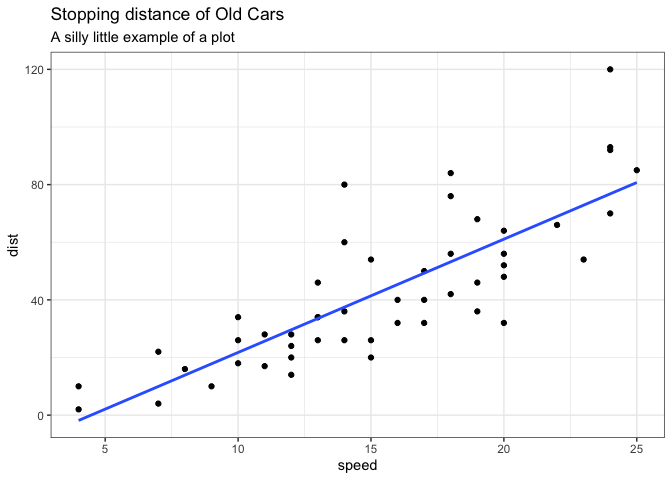
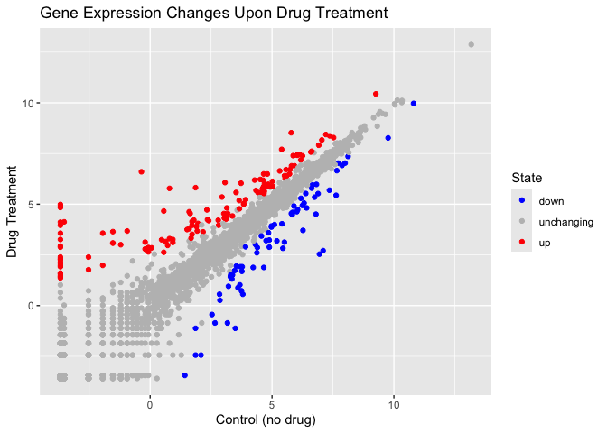
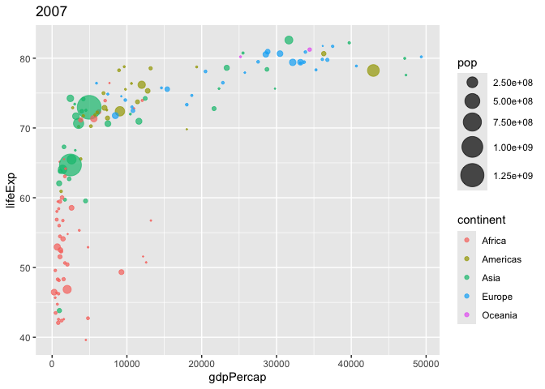
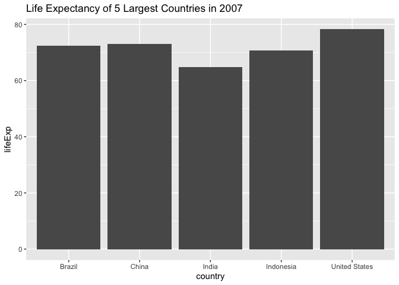
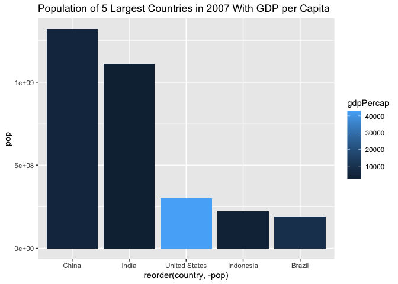

# Class05: Data Visualization w/ ggplot
Rahul Nedunuri (PID: A16297840)

# Graphics Systems in R

There are many graphics systems in R for making plots and figures.

We have already played around with **“base R”** graphics and the
`plot()` function

Today we will start learning about a popular graphics pkg called
`ggplot2()`.

This is an add on package - i.e. we need to install it. I install it
like I install any package: `install.packages()`

``` r
plot(cars)
```


Before I can use the functions from a package, I have to load up the
package from my library. We use the `library(ggplot2)` command to load
it up.

``` r
#install.packages(ggplot2)


library(ggplot2)
ggplot(cars)
```


### Every ggplot is made up of at least 3 things:

- **data**: the values that will go into your plot
- aes (**aesthetics**): how the columns of data map to the plot
  aesthetics (specifies x and y, color, etc.)
- geoms (**geometries**): how the plot actually looks; graph type
  (points, lines, or columns, etc.)

``` r
ggplot(cars) + 
  aes(x=speed, y=dist) +
  geom_point()
```


For simple plots, ggplot is more verbose than the base R plot.

Add more layers to our ggplot:

``` r
ggplot(cars) + 
  aes(x=speed, y=dist) +
  geom_point() +
  geom_smooth(method="lm", se=F) + 
  labs(title="Stopping distance of Old Cars",
       subtitle="A silly little example of a plot") +
  theme_bw()
```

    `geom_smooth()` using formula = 'y ~ x'



## Lab5 Gene Scatterplot Portion

``` r
url <- "https://bioboot.github.io/bimm143_S20/class-material/up_down_expression.txt"
genes <- read.delim(url)
nrow(genes)
```

    [1] 5196

``` r
ncol(genes)
```

    [1] 4

``` r
num_upreg = sum(genes$State == 'up') #number of upregulated genes
num_upreg
```

    [1] 127

``` r
frac_upreg = round(num_upreg / nrow(genes) * 100, 2) #percentage of upregulated genes
frac_upreg
```

    [1] 2.44

``` r
ggplot(genes) + 
    aes(x=Condition1, y=Condition2, col =State) +
    scale_colour_manual( values=c("blue","gray","red") ) +
    geom_point() +
    labs(title="Gene Expression Changes Upon Drug Treatment", x="Control (no drug)", y="Drug Treatment")
```



### Part 7

``` r
#install.packages(gapminder)
#install.packages(dplyr)

library(gapminder)
library(dplyr)
```


    Attaching package: 'dplyr'

    The following objects are masked from 'package:stats':

        filter, lag

    The following objects are masked from 'package:base':

        intersect, setdiff, setequal, union

``` r
# File location online
url <- "https://raw.githubusercontent.com/jennybc/gapminder/master/inst/extdata/gapminder.tsv"

gapminder <- read.delim(url)
gapminder_2007 <- gapminder %>% filter(year==2007)
```

2007 dataset

``` r
p <- ggplot(gapminder_2007) +
  aes(x=gdpPercap, y=lifeExp, color=continent, size=pop) +
  geom_point(alpha=0.7) + 
  scale_size_area(max_size = 10) +
  labs(title=2007)
p
```



1957 and 2007 dataset

``` r
gapminder_1957 <- gapminder %>% filter(year==1957 | year==2007)

q <- ggplot(gapminder_1957) +
  aes(x=gdpPercap, y=lifeExp, color=continent, size=pop) +
  geom_point(alpha=0.7) + 
  scale_size_area(max_size = 10) +
  facet_wrap(~year)
q
```


### Part 8 Bar Charts

5 Largest Population Countries

``` r
gapminder_top5 <- gapminder %>% 
  filter(year==2007) %>% 
  arrange(desc(pop)) %>% 
  top_n(5, pop)

gapminder_top5
```

            country continent year lifeExp        pop gdpPercap
    1         China      Asia 2007  72.961 1318683096  4959.115
    2         India      Asia 2007  64.698 1110396331  2452.210
    3 United States  Americas 2007  78.242  301139947 42951.653
    4     Indonesia      Asia 2007  70.650  223547000  3540.652
    5        Brazil  Americas 2007  72.390  190010647  9065.801

``` r
ggplot(gapminder_top5) + 
  geom_col(aes(x = country, y = lifeExp)) +
  labs(title="Life Expectancy of 5 Largest Countries in 2007")
```



``` r
r <- ggplot(gapminder_top5) +
  aes(x=reorder(country, -pop), y=pop, fill=gdpPercap) +
  geom_col() + 
  labs(title="Population of 5 Largest Countries in 2007 With GDP per Capita")

r
```


