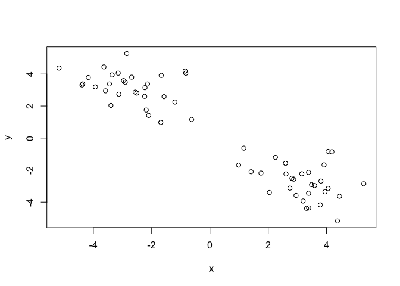
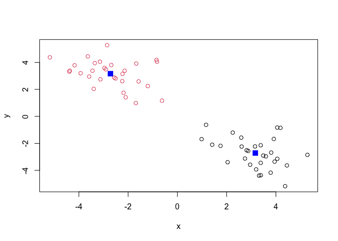
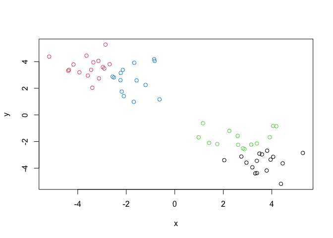
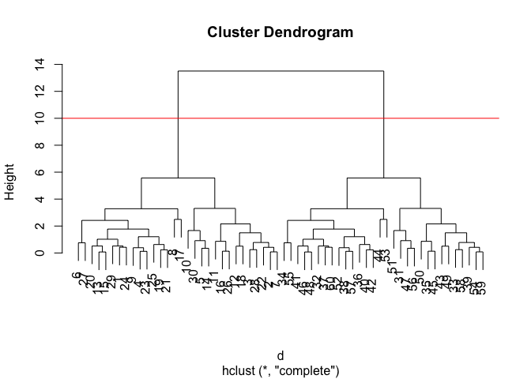
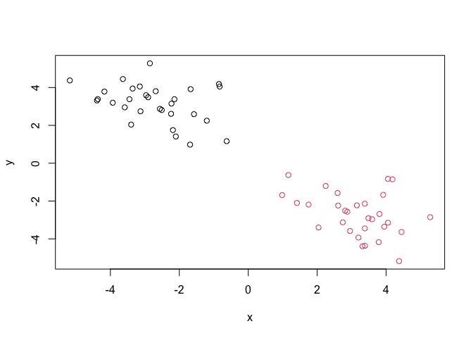
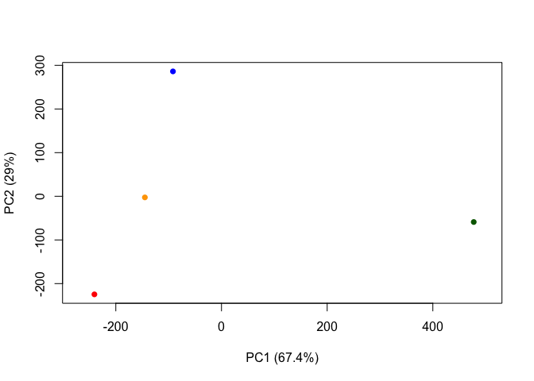
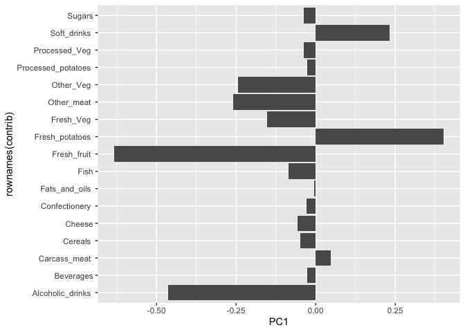

# Class 7: Machine Learning 1
Rahul Nedunuri (PID:A16297840)

## Clustering Methods

Aim: find groupings (clusters) in your input dataset.

## K means

K: Number of clusters

Let’s make up some data to cluster.

Make a vector, `tmp`, of length 60 with 30 points clustered around -3,
and another 30 points clustered around +3.

``` r
# To use rnorm: rnorm(num datapoints, mean = __, sd = ___)
tmp <- c(rnorm(30, mean=-3), rnorm(30, mean=3))
```

I will now make a wee x and y dataset with 2 groups of points.

``` r
x <- cbind(x=tmp, y=rev(tmp))
wee <- plot(x)
```



``` r
k <- kmeans(x, centers=2)
k
```

    K-means clustering with 2 clusters of sizes 30, 30

    Cluster means:
              x         y
    1  3.163966 -2.718294
    2 -2.718294  3.163966

    Clustering vector:
     [1] 2 2 2 2 2 2 2 2 2 2 2 2 2 2 2 2 2 2 2 2 2 2 2 2 2 2 2 2 2 2 1 1 1 1 1 1 1 1
    [39] 1 1 1 1 1 1 1 1 1 1 1 1 1 1 1 1 1 1 1 1 1 1

    Within cluster sum of squares by cluster:
    [1] 66.95437 66.95437
     (between_SS / total_SS =  88.6 %)

    Available components:

    [1] "cluster"      "centers"      "totss"        "withinss"     "tot.withinss"
    [6] "betweenss"    "size"         "iter"         "ifault"      

> Q. From your result object `k`, how many points are in each cluster?

``` r
k$size
```

    [1] 30 30

> Q. What “component” of your result object details the cluster
> membership?

``` r
k$cluster
```

     [1] 2 2 2 2 2 2 2 2 2 2 2 2 2 2 2 2 2 2 2 2 2 2 2 2 2 2 2 2 2 2 1 1 1 1 1 1 1 1
    [39] 1 1 1 1 1 1 1 1 1 1 1 1 1 1 1 1 1 1 1 1 1 1

> Q. Cluster centers?

``` r
k$centers
```

              x         y
    1  3.163966 -2.718294
    2 -2.718294  3.163966

> Q. Plot of our clustering results?

``` r
plot(x, col=k$cluster)
points(k$centers, col="blue", pch=15, cex=1.5)
```



What if we clustered this same data into 4 groups?

``` r
k4 <- kmeans(x, centers=4)
plot(x, col=k4$cluster)
```



A big limitation of kmeans is that it will use the number of centers you
give it: even if this number of clusters doesn’t make sense.

## Hierarchical Clustering

The base R function for Hierarchical Clustering is `hclust()`. Unlike
`kmeans()`, you **must** calculate a **distance matrix** before you can
pass your data as input.

- `kmeans()` finds a distance matrix on its own (under the hood)

``` r
d <- dist(x)
hc <- hclust(d, method="complete")
hc
```


    Call:
    hclust(d = d, method = "complete")

    Cluster method   : complete 
    Distance         : euclidean 
    Number of objects: 60 

Use `plot()` to view results.

``` r
plot(hc)
abline(h=10, col='red')
```



Note that in the dendrogram, the height represents the magnitude of
distance between two clusters.

To make the cut and get the cluster membership, we can use the
`cutree()` function.

``` r
grps <- cutree(hc, h=10)
grps
```

     [1] 1 1 1 1 1 1 1 1 1 1 1 1 1 1 1 1 1 1 1 1 1 1 1 1 1 1 1 1 1 1 2 2 2 2 2 2 2 2
    [39] 2 2 2 2 2 2 2 2 2 2 2 2 2 2 2 2 2 2 2 2 2 2

Make a plot of our data colored by hclust results.

``` r
plot(x, col=grps)
```



## Principal Component Analysis (PCA)

PCA is a method that reduces the dimensionality of features while only
losing a small amount of information.

- in a sense, we visualize the data spread by viewing the data in the
  context of PC’s as the axes rather than the initial x and y axes
- PCA is a filtering method of sorts

PC1: First principal component

- **variation in PC1 is always more significant than variation in PC2**

## PCA: Lab portion

Here we will do PCA on some food data from the UK.

Let’s read the UK foods data and find out the dimensions \### Q1

``` r
url <- "https://tinyurl.com/UK-foods"
x <- read.csv(url, row.names=1)
dim(x)
```

    [1] 17  4

Preview the dataframe

``` r
head(x)
```

                   England Wales Scotland N.Ireland
    Cheese             105   103      103        66
    Carcass_meat       245   227      242       267
    Other_meat         685   803      750       586
    Fish               147   160      122        93
    Fats_and_oils      193   235      184       209
    Sugars             156   175      147       139

### Q2

We could also have adjusted rownames and deleted the first column
manually using `x <- x[,-1]` This approach is problematic because if you
rerun it, you will keep trimming the dataframe and end up losing data
(unless you reread the csv). It is better to read the csv with an
argument to set rownames to column 1; this method is less destructive.

\###Q3

Setting the `beside=` argument to false creates a single bar for each
country.

``` r
barplot(as.matrix(x), beside=F, col=rainbow(nrow(x)))
```


### Q5

In this plot, a point on the diagonal means that there is a match
between the count of that category across 2 countries. This is confusing
to interpret.

``` r
pairs(x, col=rainbow(10), pch=16)
```


### Q6

The main difference in N. Ireland looks to be the blue and orange point
categories since they differs more from the rest of the countries.

## PCA to the rescue

The main base R function for PCA is called `prcomp()`

``` r
# Use the prcomp() PCA function 
pca <- prcomp( t(x) ) # t(x) transposes the dataframe so the countries become the rows
summary(pca)
```

    Importance of components:
                                PC1      PC2      PC3       PC4
    Standard deviation     324.1502 212.7478 73.87622 3.176e-14
    Proportion of Variance   0.6744   0.2905  0.03503 0.000e+00
    Cumulative Proportion    0.6744   0.9650  1.00000 1.000e+00

> Q. How much variance is captured by the first 2 PCs?

96.5%

PC1 is capturing 67.44% of the variation.  
PC2 is capturing 29.05% of the variation.  
PC3 is capturing 3.5% of the variation.

### Q7, Q8

To make our main “PC score plot” or “PC1 vs PC2 plot” or “PC plot” or
“Ordination plot”

``` r
attributes(pca)
```

    $names
    [1] "sdev"     "rotation" "center"   "scale"    "x"       

    $class
    [1] "prcomp"

We are after the `pca$x` result component to generate our main PCA plot

``` r
# Plot PC1 vs PC2
plot(pca$x[,1], pca$x[,2], xlab="PC1 (67.4%)", ylab="PC2 (29%)", xlim=c(-270,500), col=c('orange', 'red', 'blue', 'darkgreen'), pch=16)
```



``` r
#text(pca$x[,1], pca$x[,2], colnames(x), col=c('orange', 'red', 'blue', 'darkgreen'))
```

Another important result from PCA is how the original variables
(example: foods) factor into the PC scores.

This is contained in the `pca$rotation` object (often called the
“loadings” or “contributions”)

``` r
pca$rotation
```

                                 PC1          PC2         PC3          PC4
    Cheese              -0.056955380  0.016012850  0.02394295 -0.694538519
    Carcass_meat         0.047927628  0.013915823  0.06367111  0.489884628
    Other_meat          -0.258916658 -0.015331138 -0.55384854  0.279023718
    Fish                -0.084414983 -0.050754947  0.03906481 -0.008483145
    Fats_and_oils       -0.005193623 -0.095388656 -0.12522257  0.076097502
    Sugars              -0.037620983 -0.043021699 -0.03605745  0.034101334
    Fresh_potatoes       0.401402060 -0.715017078 -0.20668248 -0.090972715
    Fresh_Veg           -0.151849942 -0.144900268  0.21382237 -0.039901917
    Other_Veg           -0.243593729 -0.225450923 -0.05332841  0.016719075
    Processed_potatoes  -0.026886233  0.042850761 -0.07364902  0.030125166
    Processed_Veg       -0.036488269 -0.045451802  0.05289191 -0.013969507
    Fresh_fruit         -0.632640898 -0.177740743  0.40012865  0.184072217
    Cereals             -0.047702858 -0.212599678 -0.35884921  0.191926714
    Beverages           -0.026187756 -0.030560542 -0.04135860  0.004831876
    Soft_drinks          0.232244140  0.555124311 -0.16942648  0.103508492
    Alcoholic_drinks    -0.463968168  0.113536523 -0.49858320 -0.316290619
    Confectionery       -0.029650201  0.005949921 -0.05232164  0.001847469

We can make a plot along PC1.

``` r
library(ggplot2)
contrib <- as.data.frame(pca$rotation)
ggplot(contrib, aes(PC1, rownames(contrib))) + geom_col()
```


