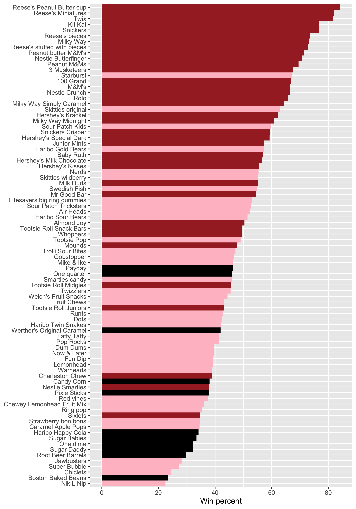

# Class 09: Halloween Mini-Project
Rahul Nedunuri (PID: A16297840)

Here we analyze a candy dataset from the 538 website. This is a csv file
from their GitHub repository.

## Importing candy data

``` r
#install.packages("skimr")
candy_file <- "candy-data.csv"

candy = read.csv(candy_file, row.names=1)
head(candy)
```

                 chocolate fruity caramel peanutyalmondy nougat crispedricewafer
    100 Grand            1      0       1              0      0                1
    3 Musketeers         1      0       0              0      1                0
    One dime             0      0       0              0      0                0
    One quarter          0      0       0              0      0                0
    Air Heads            0      1       0              0      0                0
    Almond Joy           1      0       0              1      0                0
                 hard bar pluribus sugarpercent pricepercent winpercent
    100 Grand       0   1        0        0.732        0.860   66.97173
    3 Musketeers    0   1        0        0.604        0.511   67.60294
    One dime        0   0        0        0.011        0.116   32.26109
    One quarter     0   0        0        0.011        0.511   46.11650
    Air Heads       0   0        0        0.906        0.511   52.34146
    Almond Joy      0   1        0        0.465        0.767   50.34755

> Q1. How many different candy types are in this dataset?

``` r
length(unique(rownames(candy)))
```

    [1] 85

There are 85 different candy types in this dataset.

> Q2. How many fruity candy types are in the dataset?

``` r
sum(candy$fruity)
```

    [1] 38

There are 38 fruity candy types in the dataset.

## What is your favorate candy?

> Q3. What is your favorite candy in the dataset and what is its
> winpercent value?

``` r
candy["Haribo Gold Bears", ]$winpercent
```

    [1] 57.11974

My favorite candy is Haribo Gold Bears and its win percent value is
57.12%.

> Q4. What is the winpercent value for “Kit Kat”?

``` r
candy["Kit Kat", ]$winpercent
```

    [1] 76.7686

Kit Kat’s win percent is 76.77%.

> Q5. What is the winpercent value for “Tootsie Roll Snack Bars”?

``` r
candy["Tootsie Roll Snack Bars", ]$winpercent
```

    [1] 49.6535

Tootsie Roll’s win percent is 49.65%.

> Q6. Is there any variable/column that looks to be on a different scale
> to the majority of the other columns in the dataset?

``` r
library("skimr")
skim(candy)
```

|                                                  |       |
|:-------------------------------------------------|:------|
| Name                                             | candy |
| Number of rows                                   | 85    |
| Number of columns                                | 12    |
| \_\_\_\_\_\_\_\_\_\_\_\_\_\_\_\_\_\_\_\_\_\_\_   |       |
| Column type frequency:                           |       |
| numeric                                          | 12    |
| \_\_\_\_\_\_\_\_\_\_\_\_\_\_\_\_\_\_\_\_\_\_\_\_ |       |
| Group variables                                  | None  |

Data summary

**Variable type: numeric**

| skim_variable    | n_missing | complete_rate |  mean |    sd |    p0 |   p25 |   p50 |   p75 |  p100 | hist  |
|:-----------------|----------:|--------------:|------:|------:|------:|------:|------:|------:|------:|:------|
| chocolate        |         0 |             1 |  0.44 |  0.50 |  0.00 |  0.00 |  0.00 |  1.00 |  1.00 | ▇▁▁▁▆ |
| fruity           |         0 |             1 |  0.45 |  0.50 |  0.00 |  0.00 |  0.00 |  1.00 |  1.00 | ▇▁▁▁▆ |
| caramel          |         0 |             1 |  0.16 |  0.37 |  0.00 |  0.00 |  0.00 |  0.00 |  1.00 | ▇▁▁▁▂ |
| peanutyalmondy   |         0 |             1 |  0.16 |  0.37 |  0.00 |  0.00 |  0.00 |  0.00 |  1.00 | ▇▁▁▁▂ |
| nougat           |         0 |             1 |  0.08 |  0.28 |  0.00 |  0.00 |  0.00 |  0.00 |  1.00 | ▇▁▁▁▁ |
| crispedricewafer |         0 |             1 |  0.08 |  0.28 |  0.00 |  0.00 |  0.00 |  0.00 |  1.00 | ▇▁▁▁▁ |
| hard             |         0 |             1 |  0.18 |  0.38 |  0.00 |  0.00 |  0.00 |  0.00 |  1.00 | ▇▁▁▁▂ |
| bar              |         0 |             1 |  0.25 |  0.43 |  0.00 |  0.00 |  0.00 |  0.00 |  1.00 | ▇▁▁▁▂ |
| pluribus         |         0 |             1 |  0.52 |  0.50 |  0.00 |  0.00 |  1.00 |  1.00 |  1.00 | ▇▁▁▁▇ |
| sugarpercent     |         0 |             1 |  0.48 |  0.28 |  0.01 |  0.22 |  0.47 |  0.73 |  0.99 | ▇▇▇▇▆ |
| pricepercent     |         0 |             1 |  0.47 |  0.29 |  0.01 |  0.26 |  0.47 |  0.65 |  0.98 | ▇▇▇▇▆ |
| winpercent       |         0 |             1 | 50.32 | 14.71 | 22.45 | 39.14 | 47.83 | 59.86 | 84.18 | ▃▇▆▅▂ |

Winpercent appears to be on a different scale compared to the rest of
the columns. Winpercent is in the format \_\_.\_% while the rest of the
columns are proportions aka 0.\_

> Q7. What do you think a zero and one represent for the
> candy\$chocolate column?

The 1 likely means that that row (type) of candy contains chocolate. The
0 likely means that the type of candy doesn’t contain chocolate.

``` r
inds_sorted <- order(candy$winpercent)
head(candy[inds_sorted, ])
```

                       chocolate fruity caramel peanutyalmondy nougat
    Nik L Nip                  0      1       0              0      0
    Boston Baked Beans         0      0       0              1      0
    Chiclets                   0      1       0              0      0
    Super Bubble               0      1       0              0      0
    Jawbusters                 0      1       0              0      0
    Root Beer Barrels          0      0       0              0      0
                       crispedricewafer hard bar pluribus sugarpercent pricepercent
    Nik L Nip                         0    0   0        1        0.197        0.976
    Boston Baked Beans                0    0   0        1        0.313        0.511
    Chiclets                          0    0   0        1        0.046        0.325
    Super Bubble                      0    0   0        0        0.162        0.116
    Jawbusters                        0    1   0        1        0.093        0.511
    Root Beer Barrels                 0    1   0        1        0.732        0.069
                       winpercent
    Nik L Nip            22.44534
    Boston Baked Beans   23.41782
    Chiclets             24.52499
    Super Bubble         27.30386
    Jawbusters           28.12744
    Root Beer Barrels    29.70369

Candy with lowest winpercent is Nik L Nip with 22.45%.

> Q8. Plot a histogram of winpercent values

``` r
library(ggplot2)

ggplot(candy) + aes(winpercent) + 
  geom_histogram(bins = 5)
```


> Q9. Is the distribution of winpercent values symmetrical?

The distrubtion looks to be asymmetrical and skewed to the lower win
percent values. This could be due to outliers with very low winpercent
values.

> Q10. Is the center of the distribution above or below 50%?

The center is below 50%.

> Q11. On average is chocolate candy higher or lower ranked than fruit
> candy?

``` r
choc <- candy[candy$chocolate == 1, ]
fruity <- candy[candy$fruity == 1, ]

choc_mean_win <- mean(choc$winpercent)
fruity_mean_win <- mean(fruity$winpercent)
paste("chocolate avg win ranking", choc_mean_win)
```

    [1] "chocolate avg win ranking 60.9215294054054"

``` r
paste("fruity avg win ranking", fruity_mean_win)
```

    [1] "fruity avg win ranking 44.1197414210526"

On average, chocolate candy is higher ranked than fruity candy.

> Q12. Is this difference statistically significant?

``` r
t.test(choc$winpercent, fruity$winpercent)
```


        Welch Two Sample t-test

    data:  choc$winpercent and fruity$winpercent
    t = 6.2582, df = 68.882, p-value = 2.871e-08
    alternative hypothesis: true difference in means is not equal to 0
    95 percent confidence interval:
     11.44563 22.15795
    sample estimates:
    mean of x mean of y 
     60.92153  44.11974 

From a two sample t-test, the p-value is smaller than 0.05 so the
difference between chocolate and fruity candy winpercent ratings is
statistically different at the 95% confidence level.

## Overall Candy Ratings

> Q13. What are the five least liked candy types in this set?

``` r
head(candy[order(candy$winpercent),])
```

                       chocolate fruity caramel peanutyalmondy nougat
    Nik L Nip                  0      1       0              0      0
    Boston Baked Beans         0      0       0              1      0
    Chiclets                   0      1       0              0      0
    Super Bubble               0      1       0              0      0
    Jawbusters                 0      1       0              0      0
    Root Beer Barrels          0      0       0              0      0
                       crispedricewafer hard bar pluribus sugarpercent pricepercent
    Nik L Nip                         0    0   0        1        0.197        0.976
    Boston Baked Beans                0    0   0        1        0.313        0.511
    Chiclets                          0    0   0        1        0.046        0.325
    Super Bubble                      0    0   0        0        0.162        0.116
    Jawbusters                        0    1   0        1        0.093        0.511
    Root Beer Barrels                 0    1   0        1        0.732        0.069
                       winpercent
    Nik L Nip            22.44534
    Boston Baked Beans   23.41782
    Chiclets             24.52499
    Super Bubble         27.30386
    Jawbusters           28.12744
    Root Beer Barrels    29.70369

The 5 least liked candy types are Nik L Nip, Boston Baked Beans,
Chiclets, Super Bubble, and Jawbusters

> Q14. What are the top 5 all time favorite candy types out of this set?

``` r
head(candy[order(candy$winpercent, decreasing=T),])
```

                              chocolate fruity caramel peanutyalmondy nougat
    Reese's Peanut Butter cup         1      0       0              1      0
    Reese's Miniatures                1      0       0              1      0
    Twix                              1      0       1              0      0
    Kit Kat                           1      0       0              0      0
    Snickers                          1      0       1              1      1
    Reese's pieces                    1      0       0              1      0
                              crispedricewafer hard bar pluribus sugarpercent
    Reese's Peanut Butter cup                0    0   0        0        0.720
    Reese's Miniatures                       0    0   0        0        0.034
    Twix                                     1    0   1        0        0.546
    Kit Kat                                  1    0   1        0        0.313
    Snickers                                 0    0   1        0        0.546
    Reese's pieces                           0    0   0        1        0.406
                              pricepercent winpercent
    Reese's Peanut Butter cup        0.651   84.18029
    Reese's Miniatures               0.279   81.86626
    Twix                             0.906   81.64291
    Kit Kat                          0.511   76.76860
    Snickers                         0.651   76.67378
    Reese's pieces                   0.651   73.43499

The top 5 candies are Reese’s Peanut Butter cups, Reese’s Miniatures,
Twix, Kit Kat, and Snickers

> Q15. Make a first barplot of candy ranking based on winpercent values.

``` r
#Start with all black with the same number of rows as the candy df.
my_cols=rep("black", nrow(candy))

my_cols[as.logical(candy$chocolate)] = "brown"
#my_cols[as.logical(candy$bar)] = "navy"
my_cols[as.logical(candy$fruity)] = "pink"

ggplot(candy) + 
  aes(winpercent, rownames(candy)) +
  geom_col(width=1,fill=my_cols) +
  theme(axis.text.y=element_text(size=3)) +
  labs(y= "Candy Type", x = "Win percentage")
```


> Q16. This is quite ugly, use the reorder() function to get the bars
> sorted by winpercent?

``` r
ggplot(candy) + 
  aes(winpercent, reorder(rownames(candy), winpercent)) +
  geom_col(width=1,fill=my_cols) +
  #theme(axis.text.y=element_text(size=3)) +
  labs(y= NULL, x = "Win percent")
```


``` r
ggsave('candy_barplot.png', width=7, height=10)
```



You can insert any image using this markdown syntax
``


> Q17. What is the worst ranked chocolate candy?

Based on the graph, Sixlets is the worst ranked chocolate candy.

> Q18. What is the best ranked fruity candy?

Based on the graph, Starburst is the best ranked fruity candy.

## Taking a look at pricepercent

``` r
candy$pricepercent
```

     [1] 0.860 0.511 0.116 0.511 0.511 0.767 0.767 0.511 0.325 0.325 0.511 0.511
    [13] 0.325 0.511 0.034 0.034 0.325 0.453 0.465 0.465 0.465 0.465 0.093 0.918
    [25] 0.918 0.918 0.511 0.511 0.511 0.116 0.104 0.279 0.651 0.651 0.325 0.511
    [37] 0.651 0.441 0.860 0.860 0.918 0.325 0.767 0.767 0.976 0.325 0.767 0.651
    [49] 0.023 0.837 0.116 0.279 0.651 0.651 0.651 0.965 0.860 0.069 0.279 0.081
    [61] 0.220 0.220 0.976 0.116 0.651 0.651 0.116 0.116 0.220 0.058 0.767 0.325
    [73] 0.116 0.755 0.325 0.511 0.011 0.325 0.255 0.906 0.116 0.116 0.313 0.267
    [85] 0.848

If we want to see good candies to buy in terms of high winpercent and
lowest pricepercent, we can plot these two variables and then see the
best candy for the least amount of money.

``` r
ggplot(candy) +
  aes(x=winpercent, y=pricepercent, label=(rownames(candy))) +
  geom_point(col=my_cols) +
  geom_text()
```


To avoid the labels from colliding and overlapping (overplotting), we
can use an add-on package called `ggrepel`

``` r
library(ggrepel)

ggplot(candy) +
  aes(x=winpercent, y=pricepercent, label=(rownames(candy))) +
  geom_point(col=my_cols) +
  geom_text_repel()
```

    Warning: ggrepel: 29 unlabeled data points (too many overlaps). Consider
    increasing max.overlaps


Let’s adjust the `max.overlaps` argument for `geom_text_repel()`

``` r
# Too hard to see pink labels
my_cols[as.logical(candy$fruity)] = "red"


ggplot(candy) +
  aes(x=winpercent, y=pricepercent, label=(rownames(candy))) +
  geom_point(col=my_cols) +
  geom_text_repel(max.overlaps = 10, col=my_cols)
```

    Warning: ggrepel: 29 unlabeled data points (too many overlaps). Consider
    increasing max.overlaps


> Q19. Which candy type is the highest ranked in terms of winpercent for
> the least money - i.e. offers the most bang for your buck?

Reese’s miniatures have a very high winpercent and low price percent.

> Q20. What are the top 5 most expensive candy types in the dataset and
> of these which is the least popular?

``` r
head(candy[order(candy$pricepercent, decreasing=T),])
```

                             chocolate fruity caramel peanutyalmondy nougat
    Nik L Nip                        0      1       0              0      0
    Nestle Smarties                  1      0       0              0      0
    Ring pop                         0      1       0              0      0
    Hershey's Krackel                1      0       0              0      0
    Hershey's Milk Chocolate         1      0       0              0      0
    Hershey's Special Dark           1      0       0              0      0
                             crispedricewafer hard bar pluribus sugarpercent
    Nik L Nip                               0    0   0        1        0.197
    Nestle Smarties                         0    0   0        1        0.267
    Ring pop                                0    1   0        0        0.732
    Hershey's Krackel                       1    0   1        0        0.430
    Hershey's Milk Chocolate                0    0   1        0        0.430
    Hershey's Special Dark                  0    0   1        0        0.430
                             pricepercent winpercent
    Nik L Nip                       0.976   22.44534
    Nestle Smarties                 0.976   37.88719
    Ring pop                        0.965   35.29076
    Hershey's Krackel               0.918   62.28448
    Hershey's Milk Chocolate        0.918   56.49050
    Hershey's Special Dark          0.918   59.23612

The most expensive types are Nik L Nip, Ring pop, Nestle Smarties,
Hershey’s Krackel, Hershey’s Milk Chocolate.

The least popular of these is Nik L Nip.

## Exploring the correlation structure

``` r
library(corrplot)
```

    corrplot 0.92 loaded

``` r
cij <- cor(candy)
corrplot(cij)
```


> Q22. Examining this plot what two variables are anti-correlated
> (i.e. have minus values)?

Anti correlated variables include: Fruity and chocolate fruity and bar
chocolate and hard bar and pluribus fruity and pricepercent fruity and
winpercent

> Q23. Similarly, what two variables are most positively correlated?

Most positively correlated are chocolate and winpercent

## Principal Component Analysis

``` r
pca <- prcomp(candy, scale=T)
summary(pca)
```

    Importance of components:
                              PC1    PC2    PC3     PC4    PC5     PC6     PC7
    Standard deviation     2.0788 1.1378 1.1092 1.07533 0.9518 0.81923 0.81530
    Proportion of Variance 0.3601 0.1079 0.1025 0.09636 0.0755 0.05593 0.05539
    Cumulative Proportion  0.3601 0.4680 0.5705 0.66688 0.7424 0.79830 0.85369
                               PC8     PC9    PC10    PC11    PC12
    Standard deviation     0.74530 0.67824 0.62349 0.43974 0.39760
    Proportion of Variance 0.04629 0.03833 0.03239 0.01611 0.01317
    Cumulative Proportion  0.89998 0.93832 0.97071 0.98683 1.00000

Plot my main PCA score plot with ggplot.

``` r
plot(pca$x[,1:2], col=my_cols, pch=16)
```


``` r
# Make a new data-frame with our PCA results and candy data
my_data <- cbind(candy, pca$x[,1:3])

p <- ggplot(my_data) + 
        aes(x=PC1, y=PC2, 
            text=rownames(my_data),
            label=rownames(my_data)) +
        geom_point(col=my_cols) +
        labs(title="PCA Space Map") +
        geom_text_repel(size=3.3, col=my_cols, max.overlaps = 7)

p
```

    Warning: ggrepel: 37 unlabeled data points (too many overlaps). Consider
    increasing max.overlaps


``` r
#library(ggrepel)

p  + 
  theme(legend.position = "none") +
  labs(title="Halloween Candy PCA Space",
       subtitle="Colored by type: chocolate bar (dark brown), chocolate other (light brown), fruity (red), other (black)",
       caption="Data from 538")
```

    Warning: ggrepel: 39 unlabeled data points (too many overlaps). Consider
    increasing max.overlaps


Loadings plot

``` r
loadings <- as.data.frame(pca$rotation)
ggplot(loadings) +
  aes(PC1, reorder(rownames(loadings), PC1)) +
  geom_col()
```


> Q24. What original variables are picked up strongly by PC1 in the
> positive direction? Do these make sense to you?

Positive direction includes fruity, pluribus, and hard candy. This makes
sense since these were positively correlated with one another in the
correlation matrix earlier!
