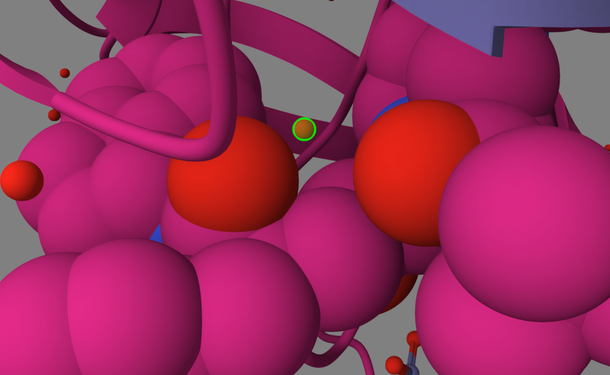

# Class 10: Structural Bioinformatics Pt.1
Rahul Nedunuri (A16297840)

## 1. Introduction to the RCSB Protein Data Bank (PDB)

Reading the data first

``` r
pdbstats <- read.csv("pdb.csv", row.names=1)
head(pdbstats)
```

                              X.ray     EM    NMR Multiple.methods Neutron Other
    Protein (only)          161,663 12,592 12,337              200      74    32
    Protein/Oligosaccharide   9,348  2,167     34                8       2     0
    Protein/NA                8,404  3,924    286                7       0     0
    Nucleic acid (only)       2,758    125  1,477               14       3     1
    Other                       164      9     33                0       0     0
    Oligosaccharide (only)       11      0      6                1       0     4
                              Total
    Protein (only)          186,898
    Protein/Oligosaccharide  11,559
    Protein/NA               12,621
    Nucleic acid (only)       4,378
    Other                       206
    Oligosaccharide (only)       22

The pdbstats df has numbers with commas in them which may be an issue.

> Q1: What percentage of structures in the PDB are solved by X-Ray and
> Electron Microscopy.

I can make a function to use for converting columns into integers.

``` r
x = '22,000'
sum(as.numeric(gsub(",", "", x)))
```

    [1] 22000

``` r
commasum <- function(x) {
  sum(as.numeric(gsub(",", "", x)))
}
```

Apply across all columns

``` r
totals <- apply(pdbstats, 2, commasum)
round(totals / totals['Total'] * 100, 2)
```

               X.ray               EM              NMR Multiple.methods 
               84.54             8.72             6.57             0.11 
             Neutron            Other            Total 
                0.04             0.02           100.00 

93.2% resolved by Xray(84.5%) and EM(8.7%)

> Q2: What proportion of structures in the PDB are protein?

``` r
round(commasum(pdbstats['Protein (only)','Total']) / commasum(pdbstats[,'Total'])* 100, 2)
```

    [1] 86.65

86.65%

## 2. Visualizing the HIV-1 protease structure

We will learn the basics of Mol\* (mol-star).
https://molstar.org/viewer/

We will play with the PDB code 1HSG

> Q4: Water molecules normally have 3 atoms. Why do we see just one atom
> per water molecule in this structure?

We see one atom per water molecule because Oxygen is large enough to be
visible at this scale but Hydrogen is too small.

> Q5: There is a critical “conserved” water molecule in the binding
> site. Can you identify this water molecule? What residue number does
> this water molecule have

H2O 308

> Q6: Generate and save a figure clearly showing the two distinct chains
> of HIV-protease along with the ligand. You might also consider showing
> the catalytic residues ASP 25 in each chain and the critical water (we
> recommend “Ball & Stick” for these side-chains). Add this figure to
> your Quarto document.

> Discussion Topic: Can you think of a way in which indinavir, or even
> larger ligands and substrates, could enter the binding site?

Larger ligands can enter the binding site since the flexible flaps of
the protein are dynamic and can open to allow the protein to enter and
bind to the active site.


Show the ASP 25 residues




## Back to R and working with PDB structures

Predict the dynamics and flexibility of a protein.

``` r
#install.packages("bio3d")
library(bio3d)

hiv <- read.pdb("1hsg")
```

      Note: Accessing on-line PDB file

``` r
hiv
```


     Call:  read.pdb(file = "1hsg")

       Total Models#: 1
         Total Atoms#: 1686,  XYZs#: 5058  Chains#: 2  (values: A B)

         Protein Atoms#: 1514  (residues/Calpha atoms#: 198)
         Nucleic acid Atoms#: 0  (residues/phosphate atoms#: 0)

         Non-protein/nucleic Atoms#: 172  (residues: 128)
         Non-protein/nucleic resid values: [ HOH (127), MK1 (1) ]

       Protein sequence:
          PQITLWQRPLVTIKIGGQLKEALLDTGADDTVLEEMSLPGRWKPKMIGGIGGFIKVRQYD
          QILIEICGHKAIGTVLVGPTPVNIIGRNLLTQIGCTLNFPQITLWQRPLVTIKIGGQLKE
          ALLDTGADDTVLEEMSLPGRWKPKMIGGIGGFIKVRQYDQILIEICGHKAIGTVLVGPTP
          VNIIGRNLLTQIGCTLNF

    + attr: atom, xyz, seqres, helix, sheet,
            calpha, remark, call

> Q7: How many amino acid residues are there in this pdb obj

198 amino acid residues.

> Q8: Name one of the two non-protein residues?

H2O.

> Q9: How many protein chains are in this structure?

2 protein chains in this structure.

``` r
head(hiv$atom)
```

      type eleno elety  alt resid chain resno insert      x      y     z o     b
    1 ATOM     1     N <NA>   PRO     A     1   <NA> 29.361 39.686 5.862 1 38.10
    2 ATOM     2    CA <NA>   PRO     A     1   <NA> 30.307 38.663 5.319 1 40.62
    3 ATOM     3     C <NA>   PRO     A     1   <NA> 29.760 38.071 4.022 1 42.64
    4 ATOM     4     O <NA>   PRO     A     1   <NA> 28.600 38.302 3.676 1 43.40
    5 ATOM     5    CB <NA>   PRO     A     1   <NA> 30.508 37.541 6.342 1 37.87
    6 ATOM     6    CG <NA>   PRO     A     1   <NA> 29.296 37.591 7.162 1 38.40
      segid elesy charge
    1  <NA>     N   <NA>
    2  <NA>     C   <NA>
    3  <NA>     C   <NA>
    4  <NA>     O   <NA>
    5  <NA>     C   <NA>
    6  <NA>     C   <NA>

Here we will do a Normal Mode Analysis (NMA) to predict functional
motions of a kinase.

``` r
adk <- read.pdb("6s36")
```

      Note: Accessing on-line PDB file
       PDB has ALT records, taking A only, rm.alt=TRUE

``` r
adk
```


     Call:  read.pdb(file = "6s36")

       Total Models#: 1
         Total Atoms#: 1898,  XYZs#: 5694  Chains#: 1  (values: A)

         Protein Atoms#: 1654  (residues/Calpha atoms#: 214)
         Nucleic acid Atoms#: 0  (residues/phosphate atoms#: 0)

         Non-protein/nucleic Atoms#: 244  (residues: 244)
         Non-protein/nucleic resid values: [ CL (3), HOH (238), MG (2), NA (1) ]

       Protein sequence:
          MRIILLGAPGAGKGTQAQFIMEKYGIPQISTGDMLRAAVKSGSELGKQAKDIMDAGKLVT
          DELVIALVKERIAQEDCRNGFLLDGFPRTIPQADAMKEAGINVDYVLEFDVPDELIVDKI
          VGRRVHAPSGRVYHVKFNPPKVEGKDDVTGEELTTRKDDQEETVRKRLVEYHQMTAPLIG
          YYSKEAEAGNTKYAKVDGTKPVAEVRADLEKILG

    + attr: atom, xyz, seqres, helix, sheet,
            calpha, remark, call

``` r
modes <- nma(adk)
```

     Building Hessian...        Done in 0.04 seconds.
     Diagonalizing Hessian...   Done in 0.487 seconds.

``` r
plot(modes)
```


Make a movie called a trajectory of the predicted morions:

``` r
mktrj(modes, file="adk_m7.pdb")
```
