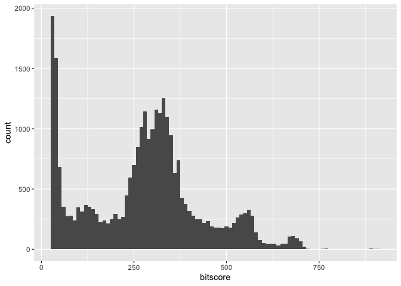
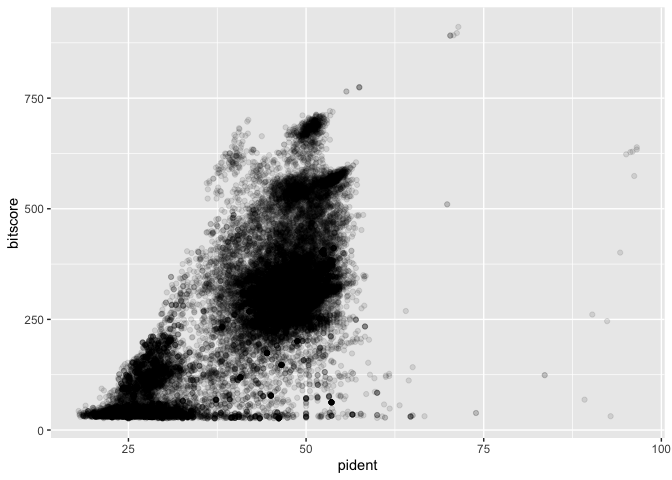
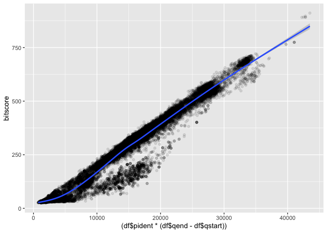

# Class 16 Zebrafish TSV
Rahul Nedunuri (PID: A16297840)

## TSV file

class16/mm-second.x.zebrafish.tsv

``` r
library(ggplot2)
library(bio3d)


df <- read.table(file = 'mm-second.x.zebrafish.tsv', sep = '\t', header = F)
colnames(df) <- c("qseqid", "sseqid", "pident", "length", "mismatch", "gapopen", "qstart", "qend", "sstart", "send", "evalue", "bitscore")
head(df)
```

           qseqid         sseqid pident length mismatch gapopen qstart qend sstart
    1 NP_598866.1 XP_009294521.1 46.154    273      130       6      4  267    420
    2 NP_598866.1 NP_001313634.1 46.154    273      130       6      4  267    476
    3 NP_598866.1 XP_009294513.1 46.154    273      130       6      4  267    475
    4 NP_598866.1 NP_001186666.1 33.071    127       76       5      4  126    338
    5 NP_598866.1 NP_001003517.1 30.400    125       82       4      4  126    344
    6 NP_598866.1 NP_001003517.1 30.645     62       41       2     53  113     43
      send   evalue bitscore
    1  684 1.70e-63    214.0
    2  740 4.51e-63    214.0
    3  739 4.69e-63    214.0
    4  459 5.19e-12     67.8
    5  465 2.67e-11     65.5
    6  103 4.40e-01     33.9

Histogram

``` r
ggplot(df, aes(x=bitscore), breaks = 30) + 
  geom_histogram(binwidth=10)
```



> What do you notice here? Note that larger bitscores are better.

I notice that the distribution looks more or less bimodal, with peaks
near 30 and then around 275. There is also a skewness with a few very
high bitscores above 750.

``` r
ggplot(df, aes(pident, bitscore)) + geom_point(alpha=0.1)
```



> Is there a straightforward relationship between percent identity
> ($pident) and bitscore ($bitscore) for the alignments we generated?

There appears to be a positively correlated relationship between pident
and bitscore. We notice, in general, that larger pidents tend to be
associated with larger bitscores.

``` r
ggplot(df, aes((df$pident * (df$qend - df$qstart)), bitscore)) + geom_point(alpha=0.1) + geom_smooth()
```

    Warning: Use of `df$pident` is discouraged.
    ℹ Use `pident` instead.

    Warning: Use of `df$qend` is discouraged.
    ℹ Use `qend` instead.

    Warning: Use of `df$qstart` is discouraged.
    ℹ Use `qstart` instead.

    Warning: Use of `df$pident` is discouraged.
    ℹ Use `pident` instead.

    Warning: Use of `df$qend` is discouraged.
    ℹ Use `qend` instead.

    Warning: Use of `df$qstart` is discouraged.
    ℹ Use `qstart` instead.

    `geom_smooth()` using method = 'gam' and formula = 'y ~ s(x, bs = "cs")'


