# Lab 18: Pertussis Mini Project
Rahul Nedunuri (PID: A16297840)

## 1. Investigsting Pertussis Cases by Year

> Q1. With the help of the R “addin” package datapasta assign the CDC
> pertussis case number data to a data frame called cdc and use ggplot
> to make a plot of cases numbers over time.

``` r
library(ggplot2)
library(datapasta)
```

``` r
library(dplyr)
```


    Attaching package: 'dplyr'

    The following objects are masked from 'package:stats':

        filter, lag

    The following objects are masked from 'package:base':

        intersect, setdiff, setequal, union

``` r
cdc <- data.frame(year = c(1922L,1923L,1924L,1925L,
                           1926L,1927L,1928L,1929L,1930L,1931L,
                           1932L,1933L,1934L,1935L,1936L,
                           1937L,1938L,1939L,1940L,1941L,1942L,
                           1943L,1944L,1945L,1946L,1947L,
                           1948L,1949L,1950L,1951L,1952L,
                           1953L,1954L,1955L,1956L,1957L,1958L,
                           1959L,1960L,1961L,1962L,1963L,
                           1964L,1965L,1966L,1967L,1968L,1969L,
                           1970L,1971L,1972L,1973L,1974L,
                           1975L,1976L,1977L,1978L,1979L,1980L,
                           1981L,1982L,1983L,1984L,1985L,
                           1986L,1987L,1988L,1989L,1990L,
                           1991L,1992L,1993L,1994L,1995L,1996L,
                           1997L,1998L,1999L,2000L,2001L,
                           2002L,2003L,2004L,2005L,2006L,2007L,
                           2008L,2009L,2010L,2011L,2012L,
                           2013L,2014L,2015L,2016L,2017L,2018L,
                           2019L,2020L,2021L),
         cases = c(107473,164191,165418,152003,
                   202210,181411,161799,197371,
                   166914,172559,215343,179135,265269,
                   180518,147237,214652,227319,103188,
                   183866,222202,191383,191890,109873,
                   133792,109860,156517,74715,69479,
                   120718,68687,45030,37129,60886,
                   62786,31732,28295,32148,40005,
                   14809,11468,17749,17135,13005,6799,
                   7717,9718,4810,3285,4249,3036,
                   3287,1759,2402,1738,1010,2177,2063,
                   1623,1730,1248,1895,2463,2276,
                   3589,4195,2823,3450,4157,4570,
                   2719,4083,6586,4617,5137,7796,6564,
                   7405,7298,7867,7580,9771,11647,
                   25827,25616,15632,10454,13278,
                   16858,27550,18719,48277,28639,32971,
                   20762,17972,18975,15609,18617,
                   6124,2116)
       )


head(cdc)
```

      year  cases
    1 1922 107473
    2 1923 164191
    3 1924 165418
    4 1925 152003
    5 1926 202210
    6 1927 181411

``` r
ggplot(cdc) +
  aes(year, cases) +
  #geom_point() +
  geom_line() +
  labs(x='Year', y='Number of Cases', title="Pertussis Cases by Year (1922-2021)")
```

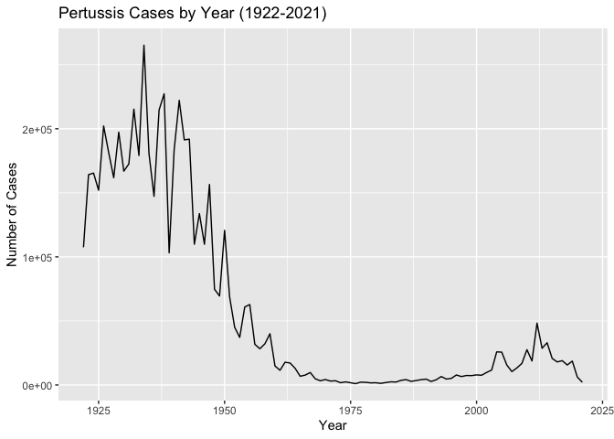

## 2. A tale of two vaccines (wP & aP)

> Q2. Using the ggplot geom_vline() function add lines to your previous
> plot for the 1946 introduction of the wP vaccine and the 1996 switch
> to aP vaccine (see example in the hint below). What do you notice?

``` r
ggplot(cdc) +
  aes(year, cases) +
  #geom_point() +
  geom_line() +
  labs(x='Year', y='Number of Cases', title="Pertussis Cases by Year (1922-2021)") +
  geom_vline(xintercept=1947, color='blue') + 
  geom_vline(xintercept=1992, color='red') + 
  geom_vline(xintercept=2020, color='orange')
```

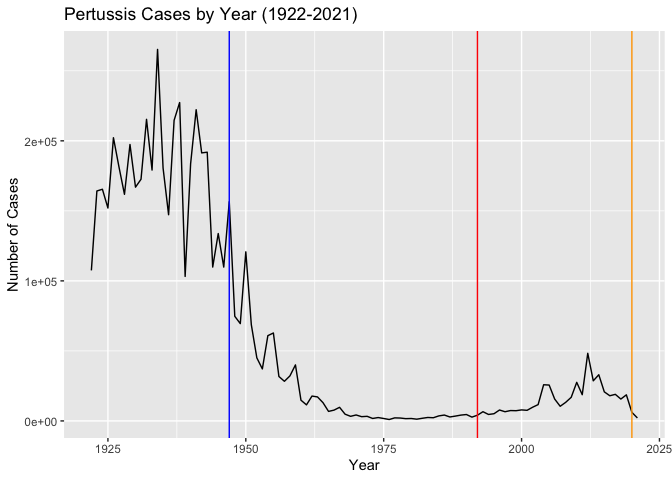

> Q3. Describe what happened after the introduction of the aP vaccine?
> Do you have a possible explanation for the observed trend?

Immune system efficacy of younger generation wanes after around 10 years
as against the older generations who received the wP vaccine.

## 3. Exploring CMI-PB data

Central question: Why does aP immunity wane faster than wP immunity?

Accessing Data from CMI-PB project

This database (like many modern projects) uses an API to return JSON
format data. We will use the R package `jsonlite`

``` r
library(jsonlite)
```

``` r
subject <- read_json("https://www.cmi-pb.org/api/subject", simplifyVector = TRUE) 
head(subject)
```

      subject_id infancy_vac biological_sex              ethnicity  race
    1          1          wP         Female Not Hispanic or Latino White
    2          2          wP         Female Not Hispanic or Latino White
    3          3          wP         Female                Unknown White
    4          4          wP           Male Not Hispanic or Latino Asian
    5          5          wP           Male Not Hispanic or Latino Asian
    6          6          wP         Female Not Hispanic or Latino White
      year_of_birth date_of_boost      dataset
    1    1986-01-01    2016-09-12 2020_dataset
    2    1968-01-01    2019-01-28 2020_dataset
    3    1983-01-01    2016-10-10 2020_dataset
    4    1988-01-01    2016-08-29 2020_dataset
    5    1991-01-01    2016-08-29 2020_dataset
    6    1988-01-01    2016-10-10 2020_dataset

> Q4. How many aP and wP infancy vaccinated subjects are in the dataset?

``` r
table(subject$infancy_vac)
```


    aP wP 
    60 58 

58 wP subjects 60 aP subjects

> Q5. How many Male and Female subjects/patients are in the dataset?

``` r
table(subject$biological_sex)
```


    Female   Male 
        79     39 

39 males 79 females

> Q6. What is the breakdown of race and biological sex (e.g. number of
> Asian females, White males etc…)?

``` r
table(subject$race, subject$biological_sex)
```

                                               
                                                Female Male
      American Indian/Alaska Native                  0    1
      Asian                                         21   11
      Black or African American                      2    0
      More Than One Race                             9    2
      Native Hawaiian or Other Pacific Islander      1    1
      Unknown or Not Reported                       11    4
      White                                         35   20

## Side note: working with dates

We can use the lubridate package to make using dates easier. `ymd` :
year-month-date `mdy` : month-day-year

``` r
library(lubridate)
```


    Attaching package: 'lubridate'

    The following objects are masked from 'package:base':

        date, intersect, setdiff, union

``` r
today()
```

    [1] "2024-03-14"

``` r
time_length( today() - ymd("2002-01-04"),  "days")
```

    [1] 8105

I am 8098 days old.

So what is the age of everyone on our dataset?

``` r
subject$age <- time_length(today() - ymd(subject$year_of_birth), "years")
head(subject)
```

      subject_id infancy_vac biological_sex              ethnicity  race
    1          1          wP         Female Not Hispanic or Latino White
    2          2          wP         Female Not Hispanic or Latino White
    3          3          wP         Female                Unknown White
    4          4          wP           Male Not Hispanic or Latino Asian
    5          5          wP           Male Not Hispanic or Latino Asian
    6          6          wP         Female Not Hispanic or Latino White
      year_of_birth date_of_boost      dataset      age
    1    1986-01-01    2016-09-12 2020_dataset 38.19849
    2    1968-01-01    2019-01-28 2020_dataset 56.19986
    3    1983-01-01    2016-10-10 2020_dataset 41.19918
    4    1988-01-01    2016-08-29 2020_dataset 36.19986
    5    1991-01-01    2016-08-29 2020_dataset 33.19918
    6    1988-01-01    2016-10-10 2020_dataset 36.19986

Let’s verify that wP subjects are generally older than aP subjects.

``` r
ggplot(subject) +
  aes(age, fill=infancy_vac) +
  geom_histogram()
```

    `stat_bin()` using `bins = 30`. Pick better value with `binwidth`.

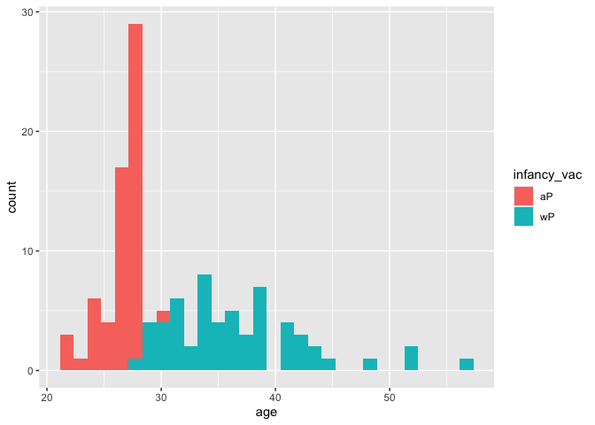

> Q7. Using this approach determine (i) the average age of wP
> individuals, (ii) the average age of aP individuals; and (iii) are
> they significantly different?

``` r
ap <- subject %>% filter(infancy_vac == "aP")

round( summary(ap$age) )
```

       Min. 1st Qu.  Median    Mean 3rd Qu.    Max. 
         21      26      26      26      27      30 

The average age of aP individuals is 26.

``` r
wp <- subject %>% filter(infancy_vac == "wP")

round( summary(wp$age) )
```

       Min. 1st Qu.  Median    Mean 3rd Qu.    Max. 
         28      31      36      37      39      56 

The average age of wP individuals is 37.

``` r
t.test(wp$age, ap$age)
```


        Welch Two Sample t-test

    data:  wp$age and ap$age
    t = 12.436, df = 65.411, p-value < 2.2e-16
    alternative hypothesis: true difference in means is not equal to 0
    95 percent confidence interval:
      8.643385 11.950080
    sample estimates:
    mean of x mean of y 
     36.59534  26.29861 

Based on a t test, the difference in age of aP and wP ages is
statistically significant at the 99% confidence level.

> Q8. Determine the age of all individuals at time of boost?

``` r
int <- ymd(subject$date_of_boost) - ymd(subject$year_of_birth)
age_at_boost <- time_length(int, "year")
head(age_at_boost)
```

    [1] 30.69678 51.07461 33.77413 28.65982 25.65914 28.77481

> Q9. With the help of a faceted boxplot or histogram (see below), do
> you think these two groups are significantly different?

Yes, with the faceted histogram, the ages of the two groups looks
significantly different.

``` r
ggplot(subject) +
  aes(time_length(age, "year"),
      fill=as.factor(infancy_vac)) +
  geom_histogram(show.legend=FALSE) +
  facet_wrap(vars(infancy_vac), nrow=2) +
  xlab("Age in years")
```

    `stat_bin()` using `bins = 30`. Pick better value with `binwidth`.

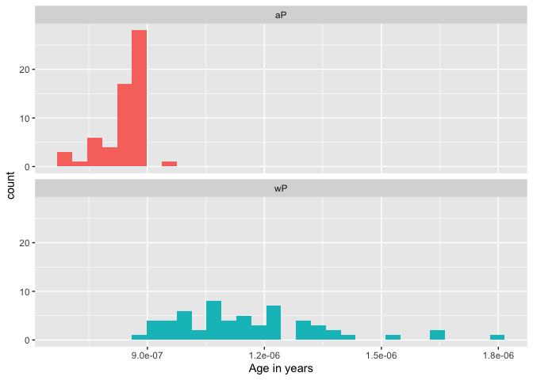

## Get more data from CMI-PB

``` r
specimen <- read_json("https://www.cmi-pb.org/api/specimen", simplifyVector = T)
head(specimen)
```

      specimen_id subject_id actual_day_relative_to_boost
    1           1          1                           -3
    2           2          1                            1
    3           3          1                            3
    4           4          1                            7
    5           5          1                           11
    6           6          1                           32
      planned_day_relative_to_boost specimen_type visit
    1                             0         Blood     1
    2                             1         Blood     2
    3                             3         Blood     3
    4                             7         Blood     4
    5                            14         Blood     5
    6                            30         Blood     6

We need to **join** the specimen and subject tables to make a single
meta table using `dplyr` join functions.

> Q9. Complete the code to join specimen and subject tables to make a
> new merged data frame containing all specimen records along with their
> associated subject details:

``` r
meta <- inner_join(subject, specimen)
```

    Joining with `by = join_by(subject_id)`

``` r
head(meta)
```

      subject_id infancy_vac biological_sex              ethnicity  race
    1          1          wP         Female Not Hispanic or Latino White
    2          1          wP         Female Not Hispanic or Latino White
    3          1          wP         Female Not Hispanic or Latino White
    4          1          wP         Female Not Hispanic or Latino White
    5          1          wP         Female Not Hispanic or Latino White
    6          1          wP         Female Not Hispanic or Latino White
      year_of_birth date_of_boost      dataset      age specimen_id
    1    1986-01-01    2016-09-12 2020_dataset 38.19849           1
    2    1986-01-01    2016-09-12 2020_dataset 38.19849           2
    3    1986-01-01    2016-09-12 2020_dataset 38.19849           3
    4    1986-01-01    2016-09-12 2020_dataset 38.19849           4
    5    1986-01-01    2016-09-12 2020_dataset 38.19849           5
    6    1986-01-01    2016-09-12 2020_dataset 38.19849           6
      actual_day_relative_to_boost planned_day_relative_to_boost specimen_type
    1                           -3                             0         Blood
    2                            1                             1         Blood
    3                            3                             3         Blood
    4                            7                             7         Blood
    5                           11                            14         Blood
    6                           32                            30         Blood
      visit
    1     1
    2     2
    3     3
    4     4
    5     5
    6     6

Now lets read some of the other data

``` r
ab_titer <- read_json("https://www.cmi-pb.org/api/v4/plasma_ab_titer", simplifyVector = TRUE) 
head(ab_titer)
```

      specimen_id isotype is_antigen_specific antigen        MFI MFI_normalised
    1           1     IgE               FALSE   Total 1110.21154       2.493425
    2           1     IgE               FALSE   Total 2708.91616       2.493425
    3           1     IgG                TRUE      PT   68.56614       3.736992
    4           1     IgG                TRUE     PRN  332.12718       2.602350
    5           1     IgG                TRUE     FHA 1887.12263      34.050956
    6           1     IgE                TRUE     ACT    0.10000       1.000000
       unit lower_limit_of_detection
    1 UG/ML                 2.096133
    2 IU/ML                29.170000
    3 IU/ML                 0.530000
    4 IU/ML                 6.205949
    5 IU/ML                 4.679535
    6 IU/ML                 2.816431

Let’s join the titer data to the existing meta dataframe using another
call to `inner_join()`

> Q10. Now using the same procedure join meta with titer data so we can
> further analyze this data in terms of time of visit aP/wP, male/female
> etc.

``` r
abdata <- inner_join(meta, ab_titer)
```

    Joining with `by = join_by(specimen_id)`

``` r
head(abdata)
```

      subject_id infancy_vac biological_sex              ethnicity  race
    1          1          wP         Female Not Hispanic or Latino White
    2          1          wP         Female Not Hispanic or Latino White
    3          1          wP         Female Not Hispanic or Latino White
    4          1          wP         Female Not Hispanic or Latino White
    5          1          wP         Female Not Hispanic or Latino White
    6          1          wP         Female Not Hispanic or Latino White
      year_of_birth date_of_boost      dataset      age specimen_id
    1    1986-01-01    2016-09-12 2020_dataset 38.19849           1
    2    1986-01-01    2016-09-12 2020_dataset 38.19849           1
    3    1986-01-01    2016-09-12 2020_dataset 38.19849           1
    4    1986-01-01    2016-09-12 2020_dataset 38.19849           1
    5    1986-01-01    2016-09-12 2020_dataset 38.19849           1
    6    1986-01-01    2016-09-12 2020_dataset 38.19849           1
      actual_day_relative_to_boost planned_day_relative_to_boost specimen_type
    1                           -3                             0         Blood
    2                           -3                             0         Blood
    3                           -3                             0         Blood
    4                           -3                             0         Blood
    5                           -3                             0         Blood
    6                           -3                             0         Blood
      visit isotype is_antigen_specific antigen        MFI MFI_normalised  unit
    1     1     IgE               FALSE   Total 1110.21154       2.493425 UG/ML
    2     1     IgE               FALSE   Total 2708.91616       2.493425 IU/ML
    3     1     IgG                TRUE      PT   68.56614       3.736992 IU/ML
    4     1     IgG                TRUE     PRN  332.12718       2.602350 IU/ML
    5     1     IgG                TRUE     FHA 1887.12263      34.050956 IU/ML
    6     1     IgE                TRUE     ACT    0.10000       1.000000 IU/ML
      lower_limit_of_detection
    1                 2.096133
    2                29.170000
    3                 0.530000
    4                 6.205949
    5                 4.679535
    6                 2.816431

> Q11. How many specimens (i.e. entries in abdata) do we have for each
> isotype?

``` r
table(abdata$isotype)
```


     IgE  IgG IgG1 IgG2 IgG3 IgG4 
    6698 3233 7961 7961 7961 7961 

Isotype: IgE IgG IgG1 IgG2 IgG3 IgG4 Entry counts: 6698 3233 7961 7961
7961 7961

> Q12. What are the different \$dataset values in abdata and what do you
> notice about the number of rows for the most “recent” dataset?

``` r
table(abdata$dataset)
```


    2020_dataset 2021_dataset 2022_dataset 
           31520         8085         2170 

The most recent dataset has the fewest number of rows (the year 2022 has
2170 rows)

``` r
table(abdata$antigen)
```


        ACT   BETV1      DT   FELD1     FHA  FIM2/3   LOLP1     LOS Measles     OVA 
       1970    1970    3435    1970    3829    3435    1970    1970    1970    3435 
        PD1     PRN      PT     PTM   Total      TT 
       1970    3829    3829    1970     788    3435 

Let’s make a boxplot of antigen types (y) and MFI (x).

``` r
ggplot(abdata) +
  aes(MFI, antigen) +
  geom_boxplot()
```

    Warning: Removed 1 row containing non-finite outside the scale range
    (`stat_boxplot()`).

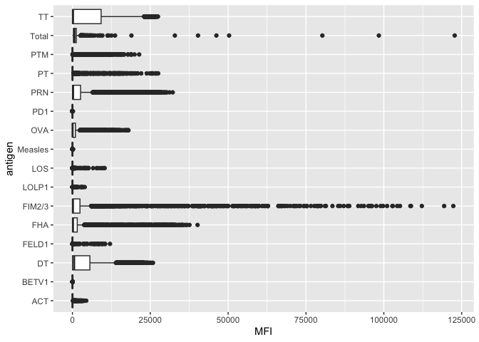

Why are certain antigens very variable?

Can you facet or even color the plot by aP vs wP (infancy_vaccination)?

``` r
ggplot(abdata) +
  aes(MFI, antigen, col=infancy_vac) +
  geom_boxplot() 
```

    Warning: Removed 1 row containing non-finite outside the scale range
    (`stat_boxplot()`).

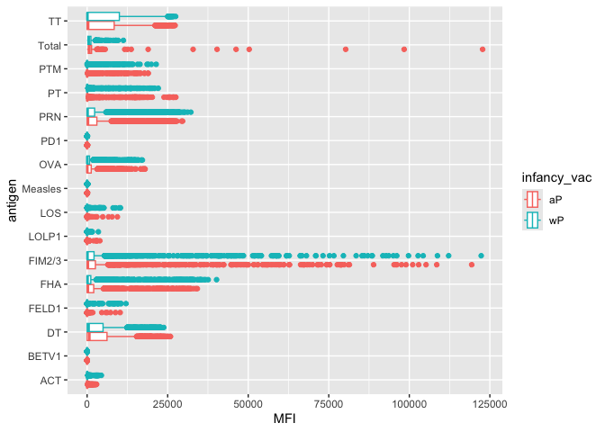

> Q13. Complete the following code to make a summary boxplot of Ab titer
> levels (MFI) for all antigens:

``` r
igg <- abdata %>% filter(isotype == "IgG")
ggplot(igg) +
  aes(MFI_normalised, antigen) +
  geom_boxplot() + 
  xlim(0,75) +
  facet_wrap(vars(visit), nrow=2)
```

    Warning: Removed 5 rows containing non-finite outside the scale range
    (`stat_boxplot()`).

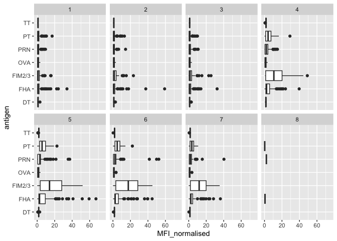

> Q14. What antigens show differences in the level of IgG antibody
> titers recognizing them over time? Why these and not others?

There are potentially some differences in antigen levels but in general
it is hard to tell with this whole dataset overview. Mainly we see
differences in the FIM2/3, PT, and FHA MFI levels over time because
these are included in the vaccine.

> Q15. Filter to pull out only two specific antigens for analysis and
> create a boxplot for each. You can chose any you like. Below I picked
> a “control” antigen (“OVA”, that is not in our vaccines) and a clear
> antigen of interest (“PT”, Pertussis Toxin, one of the key virulence
> factors produced by the bacterium B. pertussis).

``` r
filter(igg, antigen=="FIM2/3") %>%
  ggplot() +
  aes(MFI_normalised, col=infancy_vac) +
  geom_boxplot(show.legend = TRUE) +
  facet_wrap(vars(visit)) +
  theme_bw()
```

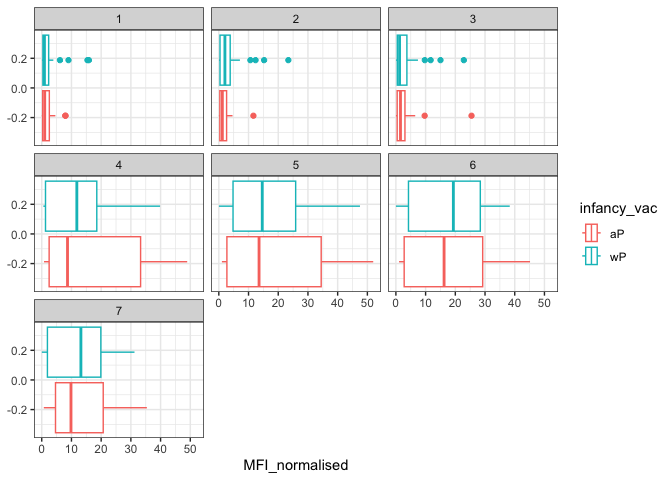

``` r
filter(igg, antigen=="PRN") %>%
  ggplot() +
  aes(MFI_normalised, col=infancy_vac) +
  geom_boxplot(show.legend = TRUE) +
  facet_wrap(vars(visit)) +
  theme_bw()
```

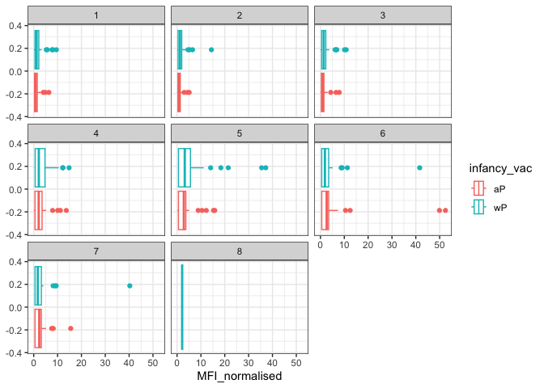

``` r
filter(igg, antigen=="PT") %>%
  ggplot() +
  aes(MFI_normalised, col=infancy_vac) +
  geom_boxplot(show.legend = TRUE) +
  facet_wrap(vars(visit)) +
  theme_bw()
```

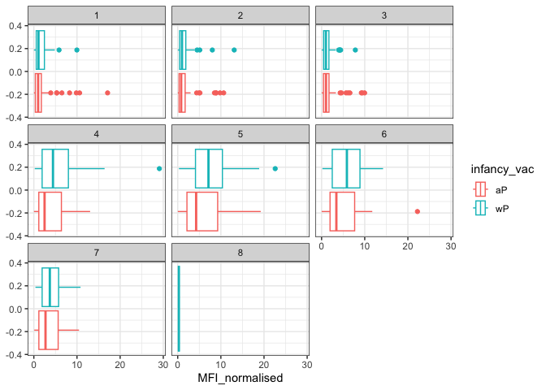

> Q16. What do you notice about these two antigens time courses and the
> PT data in particular?

It appears that PT and FIM2/3 levels clearly rise over time. Whereas PRN
appears to not be significantly changing over the duration of the
visits.

``` r
table(abdata$dataset)
```


    2020_dataset 2021_dataset 2022_dataset 
           31520         8085         2170 

Let’s focus on just the 2021_dataset

``` r
abdata.21 <- abdata %>% filter(dataset == "2021_dataset")

table(abdata.21$dataset)
```


    2021_dataset 
            8085 

Focus on PT antigen IgG levels.

``` r
pt.21 <- filter(abdata.21, isotype == "IgG", antigen == "PT")
```

Plot of planned days relative to boost and normalized MFI.

``` r
ggplot(pt.21) +
  aes(x=planned_day_relative_to_boost,
        y=MFI_normalised,
        col=infancy_vac,
        group=subject_id) +
    geom_point() +
    geom_line() +
    geom_vline(xintercept=0, linetype="dashed") +
    geom_vline(xintercept=14, linetype="dashed") +
    labs(x="Time in days after boost", y="MFI normalized levels")
```

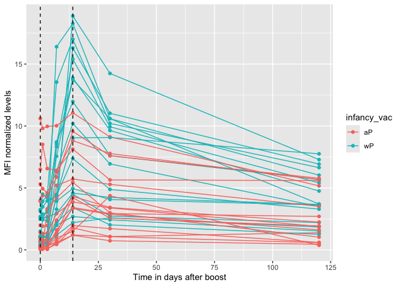

wP individuals have a higher peak 14 days post vaccination.

> Q17. Do you see any clear difference in aP vs. wP responses?

There is no clear difference in aP vs wP responses in terms of the PRN,
PT, and FIM2/3 antigen levels with the boxplot regarding each visit,
although the lineplot detailing time (in days) shows that wP individuals
have a higher peak 14 days post vaccination.
